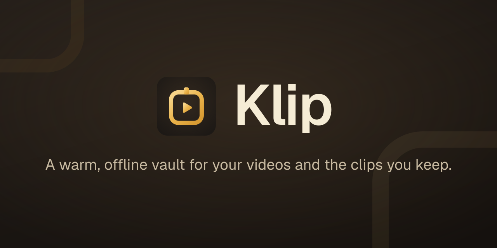

<div align="center">
  
</div>

# Klip

A local, offline-first desktop asset manager for organizing downloaded source videos and manually created video cuts. Built with Electron, React 19, and TypeScript.

> [!NOTE]
> Klip is a single-developer project built as a portfolio piece. Builds are not yet code-signed, so installers will trigger SmartScreen / Gatekeeper warnings on first run.

## Features

- **Offline-first library** — SQLite index as the single source of truth, OS file system as the storage layer
- **Automatic sync** — Chokidar watcher reconciles disk changes back into the index without manual intervention
- **YouTube downloads** — Bundled yt-dlp pipeline with channel detection, progress reporting, and post-download enrichment (description, tags, comments, view counts)
- **Media metadata** — Bundled ffprobe extracts duration, resolution, and file size on detection
- **In-app playback** — HTML5 `<video>` portaled across routes so playback survives navigation; mini-player carry-over with prev/next controls
- **Global search palette** — `Ctrl/Cmd+K` (or `/`) opens a cmdk palette with grouped results across creators, videos, cuts, and tags
- **Tag editor + bulk operations** — Multi-select grids, inline tag editing, global rename, transactional bulk updates
- **Collections** — Mixed-kind ordered playlists (videos + cuts) with "Play all" queue support
- **Soft-delete workflow** — Entities reach `'missing'` on disk loss and `'deleted'` on user action; never silently hard-deleted
- **Crash-safe operations** — Multi-step file moves (folder rename, root migration) are tracked in a persistent saga log and recovered on next launch
- **Auto-update** — `electron-updater` ships a ready-to-restart toast when a new release is published

## Tech Stack

- **Electron 41** + **electron-vite** — Desktop shell and build tooling (sandboxed renderer, contextIsolation on)
- **React 19** + **TanStack Router** + **TanStack Query** — Renderer UI, file-based routing, and data layer
- **TypeScript** — End-to-end type safety, including a typed IPC contract shared by main and renderer
- **Drizzle ORM** + **better-sqlite3** — Type-safe schema, generated migrations, and synchronous queries
- **shadcn/ui** + **Tailwind CSS v4** — UI primitives and styling, themed via OKLCH variables
- **cmdk** + **zustand** — Command palette and small client stores (player, collections selection)
- **Chokidar** — File system watching
- **yt-dlp** + **ffprobe** — Bundled binaries for downloads and probing

## Architecture

The main process follows Clean Architecture with strict layered separation:

| Layer     | Folder                        | Responsibility                                      |
| --------- | ----------------------------- | --------------------------------------------------- |
| Domain    | `src/main/domain`             | Entities, repository interfaces, port interfaces    |
| Use Cases | `src/main/use-cases`          | Application business rules                          |
| Adapters  | `src/main/interface-adapters` | IPC controllers, Drizzle repositories, FS adapters  |
| Drivers   | `src/main/framework-drivers`  | Database, watcher, yt-dlp, ffprobe, custom protocol |

The renderer talks to the main process exclusively through a typed IPC bridge exposed at `window.api`. Local media is served through a custom `klip-media://<kind>/<id>/<asset>` protocol — the renderer never sees raw filesystem paths.

For deep details (schema, ports, conventions, testing strategy), see [AGENTS.md](AGENTS.md). For a one-page overview of the project's engineering choices, see [PORTFOLIO.md](PORTFOLIO.md).

## Requirements

- Node.js 22+
- npm 11+

## Setup

```bash
npm run setup
```

Installs dependencies, downloads the bundled binaries (yt-dlp, ffprobe), and rebuilds native modules.

### Development

```bash
npm run dev
```

### Build

```bash
npm run build:win    # Windows (NSIS)
npm run build:mac    # macOS
npm run build:linux  # Linux
```

### Testing

```bash
npm run test            # Run all tests
npm run test:watch      # Watch mode
npm run test:coverage   # Coverage report (75/70/65/75 globals; ≥90/80 for use-cases)
```

### Database

```bash
npm run db:generate     # Generate migration from schema changes
npm run db:migrate      # Apply pending migrations
npm run db:studio       # Open Drizzle Studio
```

## Limitations

- **Codec coverage.** Playback uses Chromium's native `<video>` element, which decodes MP4 (H.264 / H.265 / AV1) and WebM (VP9). AVI, MKV, and FLV files are detected and indexed but cannot be played in-app — they fall back to "Open in external player" via `shell.openPath`.
- **No code-signing.** Installers are unsigned. Windows SmartScreen and macOS Gatekeeper will prompt for explicit approval; this is procurement, not a code change.
- **Single-user.** No multi-account support, no cloud sync, no remote library. The library lives in one folder on one machine.
- **YouTube only.** Downloads use yt-dlp's YouTube extractors. Other sites yt-dlp supports may work but are not exercised.

## License

MIT
